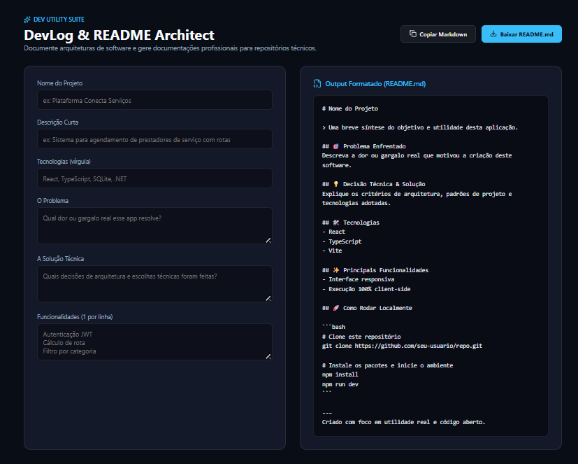

<<<<<<< HEAD
# 🛠️ DevLog & README Architect

Uma ferramenta interativa voltada para desenvolvedores, projetada para gerar documentações técnicas (`README.md`) e logs de desenvolvimento padronizados, com visualização em tempo real (Markdown Live Preview) e exportação rápida.

---

## 📸 Demonstração



---

## 🚀 Funcionalidades

- **Gerador Estruturado de Documentação:** Preenchimento guiado com seções essenciais (visão geral, tecnologias, guia de instalação, instruções de uso e licença).
- **Live Markdown Preview:** Renderização instantânea do conteúdo formatado à medida que os campos são preenchidos.
- **Badge & Tech Stack Selector:** Inclusão ágil de badges e tecnologias comuns do ecossistema de desenvolvimento.
- **Exportação com Um Clique:** Opção para copiar o código Markdown gerado para a área de transferência ou fazer o download direto do arquivo `.md`.

---

## 💻 Tecnologias Utilizadas

- **TypeScript / JavaScript (ES6+)**
- **React / Vite** (ou HTML5/CSS3 moderno)
- **Markdown Parsing & Rendering**
- **CSS3 / Dark Theme Moderno**

---

## ⚙️ Como Executar Localmente

1. Clone o repositório:
```bash
git clone <URL_DO_SEU_REPOSITORIO>
cd <NOME_DA_PASTA_DO_PROJETO>

## 📸 Demonstração


=======
# DevLog & README Architect

> Aplicação web para documentar decisões técnicas e gerar arquivos README.md profissionais e padronizados para repositórios técnicos.

## 🎯 Problema Enfrentado
Desenvolvedores frequentemente gastam tempo excessivo formatando documentações em Markdown ou deixam repositórios sem contexto técnico, dificultando a avaliação de recrutadores e bancas.

## 💡 Decisão Técnica & Solução
Desenvolvimento de uma ferramenta utilitária e reativa 100% client-side (sem dependência de backend/banco de dados) que processa dados estruturados e gera Markdown com preview instantâneo, cópia e download direto.

## 🛠️ Tecnologias
- **React**
- **TypeScript**
- **Vite**
- **Lucide React**

## ✨ Principais Funcionalidades
- Visualização em tempo real do Markdown gerado
- Cópia instantânea para a área de transferência
- Download automático do arquivo README.md
- Layout responsivo em modo escuro

## 🚀 Como Rodar Localmente

```bash
# Clone este repositório
git clone https://github.com/seu-usuario/devlog-&-readme-architect.git

# Instale os pacotes e inicie o ambiente
npm install
npm run dev
```

---
Criado com foco em utilidade real e código aberto.
>>>>>>> 101e0081c81ce549e443c62c28f55320cfffcc35
